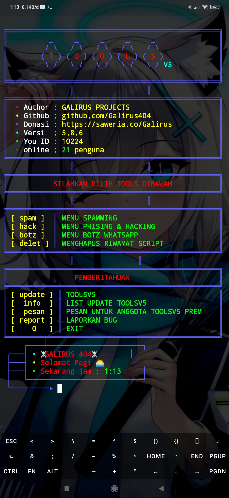

# WARNING: THIS TOOL HAVE MALWARE SCRIPT, PLEASE DON'T TRY RUNNING IT, AND DON'T RUN SCRIPT FROM OFFICIAL

# TOOLS V5

Repository ini berisi koleksi alat dan skrip untuk Termux.

## Screenshot



## Instalasi

Untuk menggunakan alat-alat ini, ikuti langkah-langkah instalasi di bawah ini di Termux:

```bash
pkg update
pkg install git bash sox mpv -y
pkg install cowsay ruby -y
gem install lolcat
git clone https://github.com/Galirus404/TOOLSV5
cd TOOLSV5
bash install.sh
